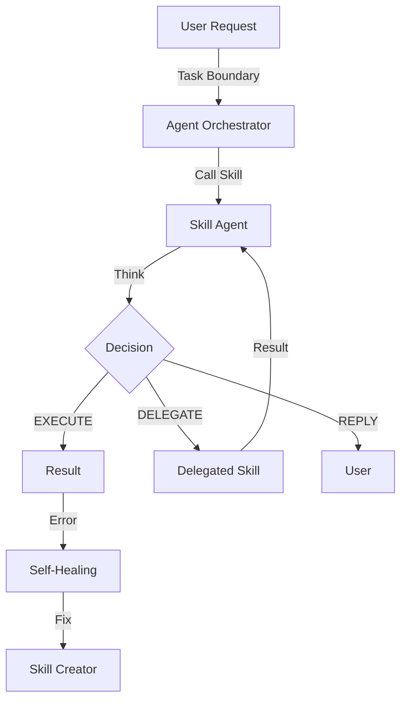

# 💻 X-Bot 开发手册

本文档专为开发者设计，详细说明了 X-Bot 的系统架构、文件结构以及功能扩展指南。

## 1. 系统架构

X-Bot 采用模块化分层设计，基于 `python-telegram-bot` 和异步 I/O 构建。

```mermaid
graph TD
    User(["👤 User"]) <-->|Telegram/Discord| AdapterLayer(["🔌 Multi-Platform Adapter Layer"])
    AdapterLayer <--> Bot(["🤖 X-Bot Server"])

    subgraph "X-Bot Core (Docker Container)"
        AdapterLayer
        Dispatcher["📨 Unified Dispatcher"]
        
        subgraph "Agentic Brain"
            AO["🧠 Agent Orchestrator"]
            TR["🧰 Tool Registry"]
            AI["✨ AiService (Gemini Agent)"]
        end
        
        subgraph "Tools & Skills"
            NativeTools["🛠️ Native Tools\n(Download, Reminder, RSS)"]
            BuiltinSkills["📂 Builtin Skills"]
            LearnedSkills["📂 Learned Skills"]
            MCP["🔌 MCP Tools\n(Memory, Browser)"]
        end

        Dispatcher -->|Text/Voice| AO
        
        AO <--> AI
        AO -->|Execute| TR
        
        TR --> NativeTools
        TR --> BuiltinSkills
        TR --> LearnedSkills
        TR --> MCP
    end

    subgraph "External Services"
        Gemini(["✨ Google Gemini API"])
        Market(["🛒 Skill Market"])
    end

    AI <--> Gemini
### 🔌 多平台适配层 (Universal Adapter Layer)
X-Bot 引入了全新的适配器架构，实现 "一次编写，到处运行"：

1.  **UnifiedContext (`src/core/platform/models.py`)**
    *   **标准化模型**：将 Telegram Update 和 Discord Interaction 统一转换为 `UnifiedMessage` 和 `UnifiedContext`。
    *   **统一接口**：提供 `.reply()`, `.reply_photo()`, `.edit_message()` 等统一方法，底层自动调用对应平台的 API。

2.  **Adapter Pattern (`src/core/platform/adapter.py`)**
    *   **BotAdapter (Base)**: 定义标准接口。
    *   **TelegramAdapter**: 封装 `python-telegram-bot`。
    *   **DiscordAdapter**: 封装 `discord.py`。

3.  **AdapterManager (`src/core/platform/registry.py`)**
    *   **统一调度**：负责启动所有注册的适配器，并将通用命令广播给所有平台。

### 🧠 智能体架构 (Agentic Core)

X-Bot 已完成从"规则路由"到"智能体核心"的进化。现在，所有的决策都由 **Agent Orchestrator** 统一管理。

1.  **Agent Orchestrator (`src/core/agent_orchestrator.py`)**
    *   **统一入口**：接收所有文本、语音和多模态消息。
    *   **动态工具集**：根据当前上下文，动态组装可用工具（Native Tools, Skills, MCP Tools）。
    *   **ReAct 循环**：驱动 Gemini 模型进行 "思考-行动-观察" 的循环，直到完成任务。

2.  **Tool Registry (`src/core/tool_registry.py`)**
    *   **统一接口**：将系统原有的零散功能（如 `download_video`, `add_reminder`）和插件化的 Skills 统一封装为标准 Agent 工具。
    *   **技能桥接**：将 `skills/` 目录下的 Python 脚本自动转换为 Function Calling 定义。

3.  **Skill Agent (`src/services/skill_agent.py`)**
    *   **Intelligent Executor**：技能系统的智能大脑。
    *   **Think-Act Loop**：负责技能执行的具体决策与委托 (Execute/Delegate/Reply)，支持 Shell/Python 执行。

4.  **AiService (`src/services/ai_service.py`)**
    *   **Agent Engine**：封装了 Gemini API 的 Function Calling 逻辑。
    *   **流式响应**：支持工具调用的实时流式反馈。

5.  **Smart Deployment Manager (`skills/builtin/deployment_manager.py`)**
    *   **Autonomous Agent**: 独立的 ReAct 智能体，专用于 Docker 部署。
    *   **Policy Enforcer**: 强制执行端口 (>20000) 和配置规范。
    *   **Silence Execution**: 具备自主思考能力，仅汇报最终结果。

---

5.  **Evolution Router (`src/core/evolution_router.py`) & Skill Creator**
    *   **Meta-Learning**: 核心进化引擎。当现有工具无法满足需求时，接管控制权。
    *   **JIT Skill Generation**: 实时生成 Python 代码 (`src/services/skill_creator.py`)，自动编写 `SKILL.md` 和 `execute.py`。
    *   **Self-Healing Loop**: 假如生成代码运行报错，自动捕获 Traceback，将错误反馈给 Creator AI 进行代码修正，实现自我治愈。

---

## 2. 核心模块说明

项目的核心代码位于 `src/` 目录下：

### 🗂️ 目录结构 (`src/`)

```
src/
├── main.py                     # 入口文件
├── agents/                     # 智能体
│   ├── skill_agent.py          # 技能智能体
├── core/                       # 核心配置与调度
│   ├── config.py               # 配置中心（环境变量、API Key）
│   ├── prompts.py              # 系统提示词
│   └── scheduler.py            # 定时任务管理
├── handlers/                   # 消息处理器
│   ├── base_handlers.py        # 基础工具（权限检查）
│   ├── start_handlers.py       # /start, /help, 主菜单
│   ├── ai_handlers.py          # AI 对话、图片/视频分析
│   ├── deployment_handlers.py  # 部署日志流式处理
│   ├── media_handlers.py       # 视频下载
│   ├── reminder_handlers.py    # 提醒功能
│   ├── subscription_handlers.py # RSS 订阅/监控
│   ├── feature_handlers.py     # 需求收集
│   ├── stock_handlers.py       # 自选股
│   ├── voice_handler.py        # 语音处理
│   ├── document_handler.py     # 文档处理
│   ├── admin_handlers.py       # 管理员命令
│   └── mcp_handlers.py         # MCP 工具调用
├── services/                   # 业务服务层
│   ├── ai_service.py           # Gemini AI 交互
│   ├── intent_router.py        # 自然语言意图路由
│   ├── deployment_service.py   # Docker 部署服务
│   ├── container_service.py    # 容器管理服务
│   ├── download_service.py     # yt-dlp 视频下载
│   ├── web_summary_service.py  # 网页抓取与摘要
│   └── stock_service.py        # 股票行情服务
├── repositories/               # 数据访问层
│   ├── base.py                 # 数据库连接与初始化
│   ├── cache_repo.py           # 视频缓存
│   ├── user_stats_repo.py      # 用户统计
│   ├── reminder_repo.py        # 提醒任务
│   ├── subscription_repo.py    # RSS 订阅
│   ├── user_settings_repo.py   # 用户设置
│   ├── allowed_users_repo.py   # 白名单
│   └── watchlist_repo.py       # 自选股
├── mcp_client/                 # MCP 客户端模块
│   ├── base.py                 # MCP 服务抽象基类
│   ├── manager.py              # MCP 服务管理器
│   ├── memory.py               # 长期记忆服务
│   └── playwright.py           # Playwright 浏览器自动化
├── stats.py                    # 统计模块
├── utils.py                    # 通用工具函数
└── user_context.py             # 用户对话上下文
```

---

6.  **skills/**                     # Skill 插件目录
    ├── builtin/                # 内置 Skill (可直接调用 Handlers)
    └── learned/                # /teach 学习到的 Skill (独立沙箱运行)

### 🏛️ 分层架构

| 层级 | 目录 | 职责 |
| :--- | :--- | :--- |
| **Skill Layer** | `skills/` | 定义功能接口、触发词，将自然语言意图转换为函数调用 |
| **Handlers** | `handlers/` | 接收 Skill 或命令调用，执行具体的 Telegram 交互 |
| **Services** | `services/` | 封装业务逻辑 (下载、AI、股票等) |
| **Repositories** | `repositories/` | 数据持久化 |

### 🛠️ 关键机制

#### 1. Skill Fail-Fast Discovery (Autonomic Router)
当 Bot 尝试从市场安装 Skill 时，采用 **Fail-Fast** 策略：
- 按相关性排序候选 Skill (Top 3)。
- 逐个尝试安装并立即**验证加载**。
- 如遇到语法错误或加载失败，**自动卸载**并尝试下一个。
- 若所有候选均失败，自动记录 **Feature Request**。

#### 2. Skill Agent (Intelligent Executor)
`SkillAgent` 替代了传统的 `SkillExecutor`，成为技能系统的智能大脑：
- **Think-Act Loop**：调用技能时，首先请求 LLM 进行决策 (`think`)。
- **Flexible Execution**：支持运行 Python 脚本 (`EXECUTE SCRIPT`)、动态生成的代码 (`EXECUTE CODE`)、直接 Shell 命令 (`EXECUTE COMMAND`) 或直接回复 (`REPLY`)。
- **Delegation**：支持技能委托 (`DELEGATE`)，例如 "股票查询" 技能可以委托 "Web Search" 技能先获取代码，实现了技能间的组合调用。

---

#### 3. Self-Evolution Loop (The Flywheel)


---

### 📝 如何添加新功能？

现在，我们强烈建议通过 **Skill** 的方式添加新功能，而不是传统的 CommandHandler。

#### 场景 A: 添加一个新的 Skill (e.g., 查汇率)

1. **自动生成**：直接对 Bot 说 "/teach 教你查汇率..."，Bot 会使用 AI 自动生成代码。
2. **手动开发**：
   - 在 `skills/builtin/` 下创建 `exchange_rate.py`
   - 定义 `SKILL_META` (名称、触发词、参数)
   - 实现 `execute(update, context, params)` 函数
   - 无需重启，Skill Loader 会自动热加载。

#### 场景 B: 开发复杂的后台功能 (需 Handler 支持)

如果 Skill 逻辑很复杂（涉及对话状态、复杂业务），建议分层：

1. **Service 层**：在 `src/services/` 实现核心逻辑
2. **Handler 层**（可选）：如果需要复用的交互逻辑，放在 `src/handlers/`
3. **Skill 层**：在 `skills/builtin/` 创建入口，调用 Service 或 Handler

#### 场景 C: 扩展 MCP 工具

1. 在 `src/mcp_client/` 集成新的 MCP Server
2. 在 `skills/builtin/` 创建一个 Skill 来调用该 MCP 工具

#### 场景 D: 添加新的数据存储
1. 在 `src/repositories/` 下创建 `weather_repo.py`
2. 在 `repositories/__init__.py` 中导出新函数
3. 在 Handler 中 `from repositories import save_weather_data`

---

## 3. 技能系统架构 (Skill System Architecture)

X-Bot 的核心竞争力在于其 **"Always Evolving" (持续进化)** 能力。技能系统并非简单的插件机制，而是 Bot 的"大脑皮层"。

### 3.1 技能分类

所有技能存储在 `skills/` 目录下，分为两大类：

1.  **Builtin Skills (`skills/builtin/`)**:
    *   **定义**: 系统预装的核心能力（如 `skill_manager`, `notebooklm`, `reminder`）。
    *   **特性**: 通常为不可变（Protected），直接集成系统底层服务，作为"元能力"。
    *   **管理**: 仅可通过代码提交修改，`skill_manager` 会拦截对 builtin 的修改请求。

2.  **Learned Skills (`skills/learned/`)**:
    *   **定义**: 后天学习或用户创建的能力（如 `crypto_checker`）。
    *   **特性**: 动态、可变、沙箱化。
    *   **来源**: 通过 `create` (AI生成)、`install` (GitHub/URL)、`teach` (自然语言教学) 获得。

### 3.2 技能结构 (Standard Format)

所有 Learned Skills 必须遵循标准目录结构：

```
skills/learned/my_awesome_skill/
├── SKILL.md            # [核心] 元数据 + 智能指南 (AI Principles)
└── scripts/            # [可选] 执行逻辑
    └── execute.py      # Python 入口函数
```

#### 核心文件: SKILL.md

这是技能的"灵魂"，不同于传统的死板 SOP，现在它更像是一份**给 Agent 的行动指南**。

**编写黄金原则**：
1. **能力而非步骤**：明确列出“你能做什么”（Action），而不是“你必须按顺序做 1,2,3...”。
2. **原则优先 (Principles over Steps)**：设定硬性约束（如端口范围、必须验证），而非具体路径。
3. **环境变量**：路径配置必须使用环境变量（支持 `${VAR}` 和 `$VAR` 格式），如 `$X_DEPLOYMENT_STAGING_PATH`。

```yaml
---
name: deployment_manager    # 唯一标识
description: |
  智能部署代理...
triggers:
- 部署
- 卸载
version: 2.0.0
---

## 核心能力 (Capabilities)
| 动作 | 说明 |
| :--- | :--- |
| `write_file` | 写入配置到 `$X_DEPLOYMENT_STAGING_PATH` |
| `verify_access` | **(必选)** 验证服务可达性 |

## 核心原则 (Core Principles) - 必须严格遵守！
1. **验证优先**：启动服务后，**必须**调用 `verify_access` 检查。只有返回 `success: true` 才是真正的成功。
2. **删除安全**：收到“删除/卸载”指令时，**除非**指令明确包含“清理数据”或“删除文件”，否则**严禁**执行删除目录或文件的操作，只能停止和移除容器。

## 典型场景参考
(提供 Deploy 和 Uninstall 的参考流程，但允许 Agent 根据实际情况灵活调整)
```

### 3.3 Skill Agent: 持续观察与执行 (Continuous ReAct)

`SkillAgent` 演进为了一个具备持续观察能力的智能体：

*   **持续观察 (Continuous Observation)**：
    *   Agent 执行动作 (Execute/Delegate) 后，**不会退出**，而是获取结果作为 Observation，进入下一轮思考。
    *   这使得 Agent 能够处理长链条任务（如：Clone -> Modify -> Up -> Verify -> Reply）。
*   **透明执行 (Transparent Execution)**：
    *   所有的 Shell 命令和脚本参数在执行前都会**实时广播**给用户，保证过程透明。
*   **安全熔断 (Circuit Breaker)**：
    *   **死循环检测**：如果 Agent 连续执行完全相同的操作（且结果相同），触发警告。
    *   **强制终止**：连续第 3 次重复时，系统强制熔断任务，防止资源耗尽。
*   **明确终结 (Explicit Termination)**：
    *   只有当 Agent 确信任务完成并发出 `REPLY` 动作（产生 `SkillFinalReply` 信号）时，循环才会结束。

### 3.4 Skill Manager: 技能系统的 OS

`skill_manager` 是一个特殊的 Builtin Skill，它是管理所有其他技能的"操作系统"。

#### 核心机制: Config vs Modify

为了平衡**稳定性**和**灵活性**，技能修改被拆分为两个独立路径：

| 特性 | `config` (配置) | `modify` (进化) |
| :--- | :--- | :--- |
| **对象** | `SKILL.md` (YAML Frontmatter) | `scripts/*.py` (代码逻辑) |
| **实现** | Python 直接读写文件 | AI (LLM) 生成新代码 |
| **速度** | ⚡️ 毫秒级 (Atomic) | 🐢 秒级 (需生成+审核) |
| **用途** | 修改 Crontab、添加 Trigger、更新描述 | 修复 Bug、重构逻辑、增加新功能 |
| **风险** | 低 (Schema 校验) | 高 (可能引入新 Bug) |

**最佳实践**:
*   想让技能每天运行？ -> **Config** (`config crontab`)
*   想让技能支持新 API？ -> **Modify** (`modify logic`)

### 3.5 定时任务机制 (Cron)

X-Bot 拥有内置的分布式兼容调度器 (`src/core/scheduler.py`)：

*   **唯一入口**: 请使用 `scheduler_manager` skill 进行定时任务管理 (`add`, `list`, `delete`)。
*   **存储**: 任务存储在 SQLite 数据库 (`scheduled_tasks` 表) 中。
*   **特性**: 修改立即生效 (支持 Hot Reload)，隐私性好，支持动态管理。
*   `EvolutionRouter` 自动生成的技能也会优先使用此方式配置定时任务。

**执行流程**:
调度器触发 -> 构造 `UnifiedContext` (System User) -> 投递给 `AgentOrchestrator` -> 智能体执行指令 (支持 Tool/Skill 调用)。

---

## 4. 环境搭建指南

### 🛠️ 环境准备

推荐使用 [uv](https://github.com/astral-sh/uv) 进行 Python 依赖管理。

```bash
# 安装 uv
curl -LsSf https://astral.sh/uv/install.sh | sh

# 安装依赖
uv sync

# 本地运行
cp .env.example .env  # 填入 API Key
# 必填配置:
# TELEGRAM_BOT_TOKEN=...
# DISCORD_BOT_TOKEN=... (可选)
# GEMINI_API_KEY=...

uv run src/main.py
```

### 🧪 运行测试

```bash
uv run pytest tests/ -v
```

---

## 4. MCP (Model Context Protocol) 扩展

MCP 模块允许 X-Bot 调用外部 MCP 服务。

### 当前支持的 MCP 服务

 | 服务类型 | 功能 | 运行方式 |
 | :--- | :--- | :--- |
 | `playwright` | 网页截图、导航、交互 | Docker |
 | `memory` | 长期记忆 (Knowledge Graph) | Local npx |

---

## 5. CLI 工具集成

部分复杂功能通过集成现有的 Python CLI 工具实现（如 `notebooklm`）。

### NotebookLM
- **实现方式**：`skills/builtin/notebooklm.py` 作为 Wrapper，通过 `subprocess` 调用 `notebooklm-py` CLI。
- **环境隔离**：每个用户的认证信息 (`storage_state.json`) 隔离存储在 `/app/data/users/{user_id}/notebooklm`。
- **依赖**：需预先安装 `notebooklm-py[browser]`。
- **交互流程**：
  1. 用户本地运行 `notebooklm login` 获取 Token。
  2. 上传认证文件给 Bot。
  3. Bot 使用 CLI 执行操作，结果返回给用户。

---

## 6. 注意事项

1. **异步编程**: 所有 I/O 操作 **必须** 使用 `await`
2. **错误处理**: 严禁未捕获异常，使用 `try...except` 并记录日志
3. **权限控制**: 敏感操作必须检查 `check_permission_unified`
4. **数据库变更**: 修改表结构需更新 `repositories/base.py` 的 `init_db`
5. **CallbackQuery**: 新增回调前缀需更新 `main.py` 的 `common_pattern` 正则

---

## 7. 安全与最佳实践 (Safety & Best Practices)

X-Bot 作为一个拥有实际系统操作权限（Docker, Shell）的 Agent，安全性至关重要。

### 7.1 删除操作安全 (Delete Safety)
所有涉及资源清理的 Skill（如卸载应用、删除文件、清理缓存）必须遵循：
*   **默认保留数据**：除非用户指令中明确包含“删除文件”、“清理数据”、“彻底删除”等关键词，否则**严禁**自动删除用户的数据目录。
*   **Prompt 防御**：在 System Prompt 和 Skill Decision Prompt 中，必须包含对“删除”意图的防御性指令。
*   **最小权限原则**：如果只需要停止服务，不要调用 `rm` 命令。

### 7.2 避免死循环 (Loop Prevention)
Agent 可能因为幻觉或逻辑错误陷入无限循环（如反复重试失败的操作）。
*   **系统熔断**：AgentOrchestrator 会检测连续重复的输出，并在第 3 次重复时强制终止任务。
*   **Skill 设计**：编写 SKILL.md 时，应引导 Agent 在遇到特定错误时**尝试不同的路径**（如查日志、修改配置），而不是盲目重试。
*   **明确终止**：确保任务成功后立即调用 `REPLY`，不要画蛇添足。

### 7.3 可见性 (Visibility)
*   **透明执行**：所有高风险操作（Shell, Write File）都应在执行前通知用户。
*   **日志记录**：关键决策点必须记录 INFO 级别日志。

---

Happy Coding! 👩‍💻👨‍💻
