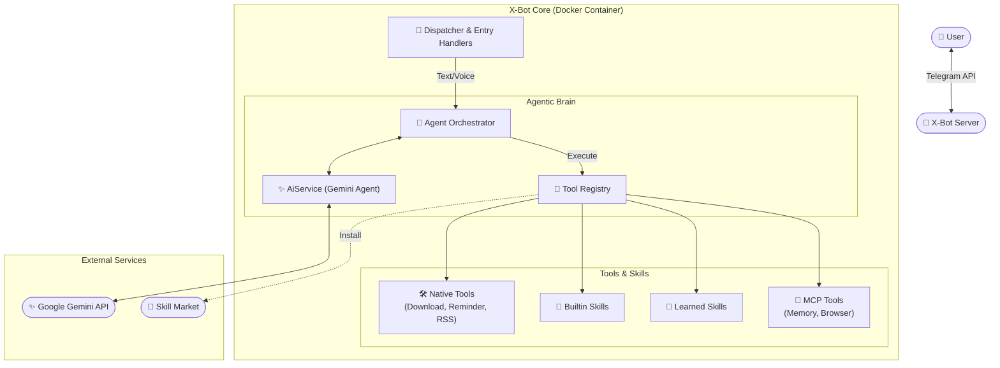

# 💻 X-Bot 开发手册

本文档专为开发者设计，详细说明了 X-Bot 的系统架构、文件结构以及功能扩展指南。

## 1. 系统架构

X-Bot 采用模块化分层设计，基于 `python-telegram-bot` 和异步 I/O 构建。



### 🧠 智能体架构 (Agentic Core)

X-Bot 已完成从"规则路由"到"智能体核心"的进化。现在，所有的决策都由 **Agent Orchestrator** 统一管理。

1.  **Agent Orchestrator (`src/core/agent_orchestrator.py`)**
    *   **统一入口**：接收所有文本、语音和多模态消息。
    *   **动态工具集**：根据当前上下文，动态组装可用工具（Native Tools, Skills, MCP Tools）。
    *   **ReAct 循环**：驱动 Gemini 模型进行 "思考-行动-观察" 的循环，直到完成任务。

2.  **Tool Registry (`src/core/tool_registry.py`)**
    *   **统一接口**：将系统原有的零散功能（如 `download_video`, `add_reminder`）和插件化的 Skills 统一封装为标准 Agent 工具。
    *   **技能桥接**：将 `skills/` 目录下的 Python 脚本自动转换为 Function Calling 定义。

3.  **AiService (`src/services/ai_service.py`)**
    *   **Agent Engine**：封装了 Gemini API 的 Function Calling 逻辑。
    *   **流式响应**：支持工具调用的实时流式反馈。

---

## 2. 核心模块说明

项目的核心代码位于 `src/` 目录下：

### 🗂️ 目录结构 (`src/`)

```
src/
├── main.py                     # 入口文件
├── core/                       # 核心配置与调度
│   ├── config.py               # 配置中心（环境变量、API Key）
│   ├── prompts.py              # 系统提示词
│   └── scheduler.py            # 定时任务管理
├── handlers/                   # 消息处理器
│   ├── base_handlers.py        # 基础工具（权限检查）
│   ├── start_handlers.py       # /start, /help, 主菜单
│   ├── ai_handlers.py          # AI 对话、图片/视频分析
│   ├── media_handlers.py       # 视频下载
│   ├── reminder_handlers.py    # 提醒功能
│   ├── subscription_handlers.py # RSS 订阅/监控
│   ├── feature_handlers.py     # 需求收集
│   ├── stock_handlers.py       # 自选股
│   ├── voice_handler.py        # 语音处理
│   ├── document_handler.py     # 文档处理
│   ├── admin_handlers.py       # 管理员命令
│   └── mcp_handlers.py         # MCP 工具调用
├── services/                   # 业务服务层
│   ├── ai_service.py           # Gemini AI 交互
│   ├── intent_router.py        # 自然语言意图路由
│   ├── download_service.py     # yt-dlp 视频下载
│   ├── web_summary_service.py  # 网页抓取与摘要
│   └── stock_service.py        # 股票行情服务
├── repositories/               # 数据访问层
│   ├── base.py                 # 数据库连接与初始化
│   ├── cache_repo.py           # 视频缓存
│   ├── user_stats_repo.py      # 用户统计
│   ├── reminder_repo.py        # 提醒任务
│   ├── subscription_repo.py    # RSS 订阅
│   ├── user_settings_repo.py   # 用户设置
│   ├── allowed_users_repo.py   # 白名单
│   └── watchlist_repo.py       # 自选股
├── mcp_client/                 # MCP 客户端模块
│   ├── base.py                 # MCP 服务抽象基类
│   ├── manager.py              # MCP 服务管理器
│   ├── memory.py               # 长期记忆服务
│   └── playwright.py           # Playwright 浏览器自动化
├── stats.py                    # 统计模块
├── utils.py                    # 通用工具函数
└── user_context.py             # 用户对话上下文
```

---

6.  **skills/**                     # Skill 插件目录
    ├── builtin/                # 内置 Skill (可直接调用 Handlers)
    └── learned/                # /teach 学习到的 Skill (独立沙箱运行)

### 🏛️ 分层架构

| 层级 | 目录 | 职责 |
| :--- | :--- | :--- |
| **Skill Layer** | `skills/` | 定义功能接口、触发词，将自然语言意图转换为函数调用 |
| **Handlers** | `handlers/` | 接收 Skill 或命令调用，执行具体的 Telegram 交互 |
| **Services** | `services/` | 封装业务逻辑 (下载、AI、股票等) |
| **Repositories** | `repositories/` | 数据持久化 |

### 🛠️ 关键机制

#### 1. Skill Fail-Fast Discovery (Autonomic Router)
当 Bot 尝试从市场安装 Skill 时，采用 **Fail-Fast** 策略：
- 按相关性排序候选 Skill (Top 3)。
- 逐个尝试安装并立即**验证加载**。
- 如遇到语法错误或加载失败，**自动卸载**并尝试下一个。
- 若所有候选均失败，自动记录 **Feature Request**。

#### 2. Skill Universal Adapter (Skill Executor)
`SkillExecutor` 实现了通用适配器模式：
- **流式响应**：实时流式传输 AI 的思考过程。
- **文件自动交付**：自动捕获沙箱中生成的任何新文件，并将其作为 Telegram Document 发送给用户，无需 Skill 开发者编写特定发送逻辑。

---

### 📝 如何添加新功能？

现在，我们强烈建议通过 **Skill** 的方式添加新功能，而不是传统的 CommandHandler。

#### 场景 A: 添加一个新的 Skill (e.g., 查汇率)

1. **自动生成**：直接对 Bot 说 "/teach 教你查汇率..."，Bot 会使用 AI 自动生成代码。
2. **手动开发**：
   - 在 `skills/builtin/` 下创建 `exchange_rate.py`
   - 定义 `SKILL_META` (名称、触发词、参数)
   - 实现 `execute(update, context, params)` 函数
   - 无需重启，Skill Loader 会自动热加载。

#### 场景 B: 开发复杂的后台功能 (需 Handler 支持)

如果 Skill 逻辑很复杂（涉及对话状态、复杂业务），建议分层：

1. **Service 层**：在 `src/services/` 实现核心逻辑
2. **Handler 层**（可选）：如果需要复用的交互逻辑，放在 `src/handlers/`
3. **Skill 层**：在 `skills/builtin/` 创建入口，调用 Service 或 Handler

#### 场景 C: 扩展 MCP 工具

1. 在 `src/mcp_client/` 集成新的 MCP Server
2. 在 `skills/builtin/` 创建一个 Skill 来调用该 MCP 工具

#### 场景 D: 添加新的数据存储
1. 在 `src/repositories/` 下创建 `weather_repo.py`
2. 在 `repositories/__init__.py` 中导出新函数
3. 在 Handler 中 `from repositories import save_weather_data`

---

## 3. 环境搭建指南

### 🛠️ 环境准备

推荐使用 [uv](https://github.com/astral-sh/uv) 进行 Python 依赖管理。

```bash
# 安装 uv
curl -LsSf https://astral.sh/uv/install.sh | sh

# 安装依赖
uv sync

# 本地运行
cp .env.example .env  # 填入 API Key
uv run src/main.py
```

### 🧪 运行测试

```bash
uv run pytest tests/ -v
```

---

## 4. MCP (Model Context Protocol) 扩展

MCP 模块允许 X-Bot 调用外部 MCP 服务。

### 当前支持的 MCP 服务

 | 服务类型 | 功能 | 运行方式 |
 | :--- | :--- | :--- |
 | `playwright` | 网页截图、导航、交互 | Docker |
 | `memory` | 长期记忆 (Knowledge Graph) | Local npx |

---

## 5. 注意事项

1. **异步编程**: 所有 I/O 操作 **必须** 使用 `await`
2. **错误处理**: 严禁未捕获异常，使用 `try...except` 并记录日志
3. **权限控制**: 敏感操作必须检查 `check_permission`
4. **数据库变更**: 修改表结构需更新 `repositories/base.py` 的 `init_db`
5. **CallbackQuery**: 新增回调前缀需更新 `main.py` 的 `common_pattern` 正则

---

Happy Coding! 👩‍💻👨‍💻
