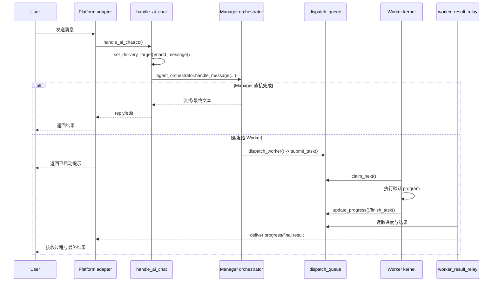

# X-Bot 项目总览

> 本文以当前仓库实现为准，聚焦已落地结构；更细的约束与启动说明建议先读 `README.md` 和 `DEVELOPMENT.md`。

## 1. 项目定位

X-Bot 是一个多平台 AI Bot，当前采用 `Manager + Worker + API` 三服务拆分架构，而不是单进程“万能 bot”。

| 服务 | 入口 | 主要职责 |
| --- | --- | --- |
| Core Manager | `src/main.py` | 平台消息入口、提示词与工具装配、技能加载、任务编排、结果回传、manager 侧开发工具链 |
| Worker Kernel | `src/worker_main.py` | 从共享队列 claim 任务、续租 lease、执行默认 program、写回结果与进度 |
| API Service | `src/api/main.py` | `FastAPI + SPA`，提供 `/api/v1/*` 与 Web/API 能力 |

这个拆分对应 `README.md` 中的运行形态说明，以及 `DEVELOPMENT.md` 中的职责边界定义。

## 2. 主要目录与职责

| 路径 | 职责 | 典型文件 |
| --- | --- | --- |
| `src/core/` | 编排、提示词、工具面、状态访问、heartbeat 治理 | `agent_orchestrator.py`, `orchestrator_runtime_tools.py`, `state_store.py` |
| `src/handlers/` | 聊天与命令入口，把平台消息接入 core | `ai_handlers.py`, `start_handlers.py`, `worker_handlers.py` |
| `src/manager/` | worker 派发、结果 relay、manager 开发工具链 | `dispatch/service.py`, `relay/result_relay.py` |
| `src/worker/` | worker kernel 与 program/runtime 加载 | `kernel/daemon.py`, `programs/core_agent_program.py` |
| `src/shared/` | manager/worker 共用协议与 JSONL 队列 | `contracts/dispatch.py`, `queue/dispatch_queue.py` |
| `src/platforms/` | Telegram / Discord / DingTalk / Web 适配层 | `telegram/adapter.py`, `discord/adapter.py` |
| `src/services/` | LLM、下载、搜索等外部服务集成 | `ai_service.py`, `web_summary_service.py` |
| `src/api/` | Web/API 服务与 SPA 托管 | `main.py`, `api/`, `core/` |
| `skills/` | 运行时技能扩展 | `skills/builtin/*/SKILL.md`, `skills/learned/*/SKILL.md` |
| `data/` | 文件系统优先的运行态数据 | 队列、聊天、任务、权限、heartbeat、worker 元数据 |
| `tests/` | async pytest 回归测试 | `tests/core/`, `tests/manager/`, `tests/shared/` |

## 3. 主请求生命周期

### 3.1 生命周期总览

### 3.2 关键执行链路

1. `src/main.py` 注册平台 adapter、命令和消息 handler，并启动结果 relay。
2. 普通文本消息进入 `src/handlers/ai_handlers.py` 的 `handle_ai_chat()`。
3. 入口会先更新当前会话的 delivery target，并把用户消息写入聊天状态。
4. 然后调用 `src/core/agent_orchestrator.py` 的 `AgentOrchestrator.handle_message()`。
5. 编排层会构造运行时上下文、装配工具面、调用模型，并在需要时走两条分支：
   - manager 直连执行：直接调用原语工具或 manager 导出工具，结果在当前会话里流式返回；
   - worker 派发执行：通过 `dispatch_worker` 写入共享队列，由 worker 异步完成后再由 relay 回传。
6. worker 侧入口在 `src/worker/kernel/daemon.py`，默认 program 在 `src/worker/programs/core_agent_program.py`。
7. 结果回传由 `src/manager/relay/result_relay.py` 负责，必要时还会处理 staged session、waiting_user、进度消息和附件投递。

## 4. 子系统依赖与边界

| 子系统 | 负责什么 | 依赖什么 | 边界说明 |
| --- | --- | --- | --- |
| `platforms` | 统一平台 SDK 与发送能力 | `core.platform.*` | 适配层应薄，不承载业务编排 |
| `handlers` | 用户入口、上下文整理、权限检查 | `core`, `services` | 负责把请求送进 core，不直接承担长流程治理 |
| `core` | 编排、工具装配、状态协议、prompt/heartbeat | `services`, `shared`, 部分 `manager` 桥接 | 是系统中枢，但不直接承担 worker queue loop |
| `manager` | 派发、结果 relay、manager 开发工具链 | `core`, `shared` | 管治理与交付，不让 worker 直接面向平台 |
| `worker` | 队列消费与执行 | `shared`, `core` | 只执行任务，不承载平台入口 |
| `shared` | 跨进程契约、队列、公共模型 | 无上层业务依赖 | 是 manager/worker 的底层交汇点 |
| `api` | HTTP/SPA 与 Web 业务 | `core`, `shared`, `services` | 独立服务，不参与聊天主循环 |

需要特别注意的关系：

- `worker` 并不是另一套独立 AI 系统，而是复用 `core` 的同一套 orchestrator，在 worker 身份与权限面下运行。
- `core` 会通过 tool shim 暴露部分 `manager` 能力，例如 `dispatch_worker`、`git_ops`、`gh_cli`。
- `shared` 是真正的底层公共层，`manager` 和 `worker` 通过 `TaskEnvelope` / `TaskResult` 与 JSONL 队列协作。

## 5. 持久化模型与关键数据路径

项目采用文件系统优先持久化；与其直接写磁盘，不如统一通过 `src/core/state_paths.py`、`src/core/state_io.py`、`src/core/state_store.py` 访问。

| 数据 | 典型路径 | 主要模块 |
| --- | --- | --- |
| 共享用户根目录 | `data/user/` | `state_paths.py` |
| 逻辑用户登记 | `data/user/.logical_user_ids.json` | `state_paths.py` |
| 系统根目录 | `data/system/` | `state_paths.py` |
| dispatch tasks | `data/system/dispatch/tasks.jsonl` | `shared/queue/dispatch_queue.py` |
| dispatch results | `data/system/dispatch/results.jsonl` | `shared/queue/dispatch_queue.py` |
| tool access policy | `data/kernel/tool_access.json` | `core/tool_access_store.py` |
| worker registry | `data/WORKERS.json` | `core/worker_store.py` |
| worker root | `data/userland/workers/` | `core/worker_store.py` |
| heartbeat 文档 | `data/HEARTBEAT*.md` | `core/heartbeat_store.py` |
| heartbeat 状态 | `data/runtime_tasks/<user>/STATUS.json` | `core/heartbeat_store.py` |
| task inbox | `data/task_inbox/` | `core/task_inbox.py` |
| API SQLite | `data/bot_data.db` | `api/core/database.py` |

补充说明：

- 运行态状态不止一种格式：队列与注册表大量使用 JSON/JSONL，部分 canonical state 使用 Markdown + fenced YAML。
- 新代码不要绕开 `state_paths` / `state_store` 自己拼路径。
- `DEVELOPMENT.md` 已明确：Manager 负责治理和回传，Worker 负责执行，普通新增功能应尽量遵守这条边界。

## 6. 关键入口与推荐阅读顺序

建议新贡献者按下面顺序建立心智模型：

1. `README.md`：先理解项目形态、启动方式和能力面。
2. `DEVELOPMENT.md`：明确 Manager / Worker / API 的职责边界。
3. `src/main.py`、`src/worker_main.py`、`src/api/main.py`：建立三个进程的启动模型。
4. `src/handlers/ai_handlers.py`：看普通聊天请求如何进入系统。
5. `src/core/agent_orchestrator.py`、`src/core/orchestrator_runtime_tools.py`：看 manager 侧的核心编排与工具执行。
6. `src/manager/dispatch/service.py`、`src/shared/queue/dispatch_queue.py`、`src/worker/kernel/daemon.py`、`src/manager/relay/result_relay.py`：看完整的异步派发闭环。
7. `src/core/state_paths.py`、`src/core/state_store.py`、`src/core/heartbeat_store.py`、`src/core/task_inbox.py`：补齐状态模型与持久化约束。
8. `tests/core/test_orchestrator_single_loop.py`、`tests/core/test_orchestrator_delivery_closure.py`、`tests/core/test_worker_result_relay.py`：用测试验证对主流程的理解。

如果你的工作偏向某个子方向，也可以按需跳转：

- Web/API：优先看 `src/api/main.py` 与 `src/api/api/*`
- 技能系统：优先看 `src/core/skill_loader.py`、`src/core/tool_registry.py`、`skills/*/SKILL.md`
- manager 开发工具链：优先看 `src/manager/dev/*` 与 `src/manager/integrations/gh_cli_service.py`

## 7. 一句话总结

这个仓库最核心的设计点，是把“平台入口与治理编排”放在 Manager，把“隔离执行”放在 Worker，并用 `shared` 队列契约把两者衔接起来；而 Manager 与 Worker 实际上复用了同一套 core orchestrator，只是在运行身份、工具面和权限策略上有所区别。
