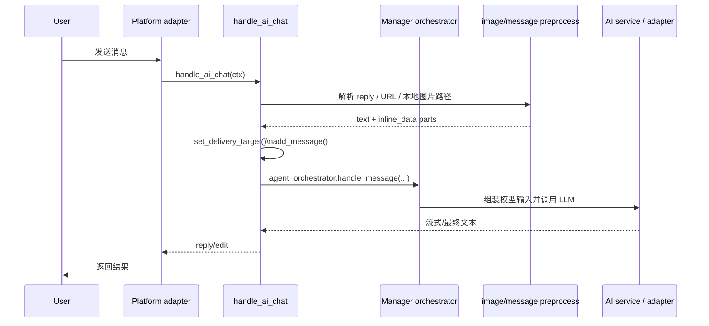

# X-Bot 项目总览

> 本文以当前仓库实现为准，聚焦已落地结构；更细的约束与启动说明建议先读 `README.md` 和 `DEVELOPMENT.md`。

## 1. 项目定位

X-Bot 是一个多平台 AI Bot，当前采用 `Core Manager + API Service` 双主体架构。用户请求统一进入 Manager，由它负责编排、交付、任务治理和必要的 in-process subagent 协作。

| 服务 | 入口 | 主要职责 |
| --- | --- | --- |
| Core Manager | `src/main.py` | 平台消息入口、提示词与工具装配、技能加载、任务编排、结果回传、heartbeat、manager 侧开发工具链 |
| API Service | `src/api/main.py` | `FastAPI + SPA`，提供 `/api/v1/*` 与 Web/API 能力 |

这个拆分对应 `README.md` 中的运行形态说明，以及 `DEVELOPMENT.md` 中的职责边界定义。历史上的独立 Worker 运行面已经删除，不再是当前实现的一部分。

## 2. 主要目录与职责

| 路径 | 职责 | 典型文件 |
| --- | --- | --- |
| `src/core/` | 编排、提示词、工具面、状态访问、heartbeat 治理 | `agent_orchestrator.py`, `orchestrator_runtime_tools.py`, `state_store.py` |
| `src/handlers/` | 聊天与命令入口，把平台消息接入 core | `ai_handlers.py`, `message_utils.py`, `task_handlers.py` |
| `src/manager/` | manager 侧闭环、开发、集成服务 | `relay/closure_service.py`, `coding/`, `integrations/` |
| `src/shared/` | 跨模块共享契约与类型 | `models/`, `contracts/` |
| `src/platforms/` | Telegram / Discord / DingTalk / Web 适配层 | `telegram/adapter.py`, `discord/adapter.py` |
| `src/services/` | LLM、下载、搜索等外部服务集成 | `ai_service.py`, `web_summary_service.py`, `image_input_service.py` |
| `src/api/` | Web/API 服务与 SPA 托管 | `main.py`, `api/`, `core/` |
| `skills/` | 运行时技能扩展 | `skills/builtin/*/SKILL.md`, `skills/learned/*/SKILL.md` |
| `data/` | 文件系统优先的运行态数据 | 聊天、任务、权限、heartbeat、审计与 API 数据 |
| `tests/` | async pytest 回归测试 | `tests/core/`, `tests/manager/`, `tests/shared/` |

## 3. 主请求生命周期

### 3.1 生命周期总览

### 3.2 关键执行链路

1. `src/main.py` 注册平台 adapter、命令和消息 handler，并启动 heartbeat 等后台治理组件。
2. 普通文本消息进入 `src/handlers/ai_handlers.py` 的 `handle_ai_chat()`。
3. 入口会先更新当前会话的 delivery target，并把用户消息写入聊天状态。
4. 如果文本中包含图片 URL、本地绝对图片路径，或 reply 中包含可解析图片，入口会先把它们归一化成 `inline_data`。
5. 然后调用 `src/core/agent_orchestrator.py` 的 `AgentOrchestrator.handle_message()`。
6. 编排层会构造运行时上下文、装配工具面、调用模型，并在需要时启动 in-process `subagent` 做受控并发。
7. 视觉输入会沿用 `src/services/ai_service.py` 与 `src/services/openai_adapter.py` 的现有 vision 链路自动选模并发往 LLM。

## 4. 子系统依赖与边界

| 子系统 | 负责什么 | 依赖什么 | 边界说明 |
| --- | --- | --- | --- |
| `platforms` | 统一平台 SDK 与发送能力 | `core.platform.*` | 适配层应薄，不承载业务编排 |
| `handlers` | 用户入口、上下文整理、权限检查 | `core`, `services` | 负责把请求送进 core，不直接承担长流程治理 |
| `core` | 编排、工具装配、状态协议、prompt/heartbeat | `services`, `shared`, 部分 `manager` 桥接 | 是系统中枢，普通请求默认在这里闭环 |
| `manager` | 闭环、开发工具链、集成服务 | `core`, `shared` | 仍属于主运行面，不是独立执行进程 |
| `shared` | 跨模块契约、公共模型 | 无上层业务依赖 | 作为复用层存在，但不再承担 manager/worker 队列桥接 |
| `api` | HTTP/SPA 与 Web 业务 | `core`, `shared`, `services` | 独立服务，不参与聊天主循环 |

需要特别注意的关系：

- `Core Manager` 是唯一用户可见的聊天运行面。
- 图片 URL / 本地图片路径的读取和校验发生在 handler 层，模型只接收标准化后的 `inline_data`。
- `heartbeat_worker` 是内部后台调度组件，不代表历史上的独立 Worker 架构。

## 5. 持久化模型与关键数据路径

项目采用文件系统优先持久化；与其直接写磁盘，不如统一通过 `src/core/state_paths.py`、`src/core/state_io.py`、`src/core/state_store.py` 访问。

| 数据 | 典型路径 | 主要模块 |
| --- | --- | --- |
| 共享用户根目录 | `data/user/` | `state_paths.py` |
| 逻辑用户登记 | `data/user/.logical_user_ids.json` | `state_paths.py` |
| 系统根目录 | `data/system/` | `state_paths.py` |
| tool access policy | `data/kernel/tool_access.json` | `core/tool_access_store.py` |
| heartbeat 文档 | `data/HEARTBEAT*.md` | `core/heartbeat_store.py` |
| heartbeat 状态 | `data/runtime_tasks/<user>/STATUS.json` | `core/heartbeat_store.py` |
| task inbox | `data/task_inbox/` | `core/task_inbox.py` |
| API SQLite | `data/bot_data.db` | `api/core/database.py` |

补充说明：

- 运行态状态不止一种格式：队列与注册表大量使用 JSON/JSONL，部分 canonical state 使用 Markdown + fenced YAML。
- 新代码不要绕开 `state_paths` / `state_store` 自己拼路径。
- `DEVELOPMENT.md` 已明确：普通新增功能默认补在 Manager 入口或其编排链路里，不要重新引入独立 Worker 执行面。

## 6. 关键入口与推荐阅读顺序

建议新贡献者按下面顺序建立心智模型：

1. `README.md`：先理解项目形态、启动方式和能力面。
2. `DEVELOPMENT.md`：明确 Manager / API / subagent 的职责边界。
3. `src/main.py`、`src/api/main.py`：建立主运行面与 API 的启动模型。
4. `src/handlers/ai_handlers.py`：看普通聊天请求如何进入系统。
5. `src/handlers/message_utils.py`、`src/services/image_input_service.py`：看图片 URL / 本地图片路径如何转成 vision 输入。
6. `src/core/agent_orchestrator.py`、`src/core/orchestrator_runtime_tools.py`：看 manager 侧的核心编排与工具执行。
7. `src/core/state_paths.py`、`src/core/state_store.py`、`src/core/heartbeat_store.py`、`src/core/task_inbox.py`：补齐状态模型与持久化约束。
8. `tests/core/test_orchestrator_single_loop.py`、`tests/core/test_orchestrator_delivery_closure.py`、`tests/core/test_task_inbox.py`：用测试验证对主流程的理解。

如果你的工作偏向某个子方向，也可以按需跳转：

- Web/API：优先看 `src/api/main.py` 与 `src/api/api/*`
- 技能系统：优先看 `src/core/skill_loader.py`、`src/core/tool_registry.py`、`skills/*/SKILL.md`
- manager 开发工具链：优先看 `src/manager/dev/*` 与 `src/manager/integrations/gh_cli_service.py`

## 7. 一句话总结

这个仓库最核心的设计点，是把“平台入口、治理编排、视觉输入归一化和最终交付”统一放在 Core Manager；API 负责 Web 面能力，必要并发通过 in-process `subagent` 完成，而不是重新引入独立 Worker 运行面。
